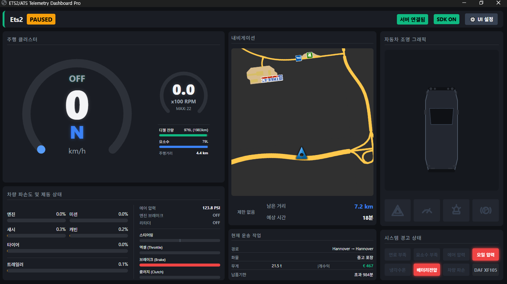
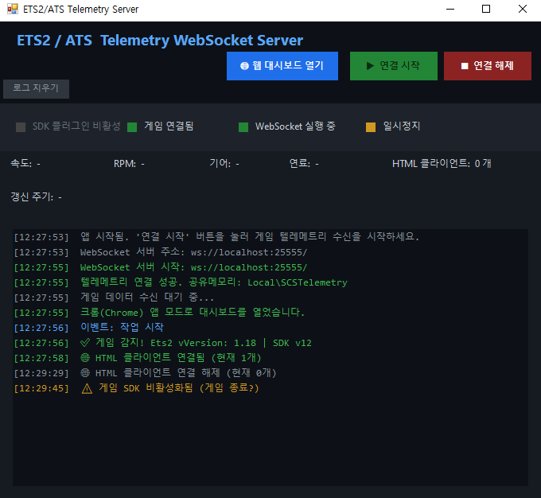

# ETS2 / ATS 텔레메트리 대시보드 서버

<p align="center">
  
</p>

---

## 🔗 원본 참조 (원본 저장소)

이 프로젝트는 다음 오픈소스 프로젝트들을 기반으로 제작되었습니다.

| 역할 | 저장소 |
|---|---|
| **SCS SDK 플러그인 (C++)** | [nlhans/ets2-sdk-plugin](https://github.com/nlhans/ets2-sdk-plugin) (원본) |
| **SCS SDK C# 클라이언트** | [RenCloud/scs-sdk-plugin](https://github.com/RenCloud/scs-sdk-plugin) |
| **ETS2 지도 타일 및 내비게이션** | [mike-koch/ets2-mobile-route-advisor](https://github.com/mike-koch/ets2-mobile-route-advisor) |

---

## ✨ 원본 대비 수정/추가 사항

### C# 서버 (`TelemetryWebSocketServer.cs`)
- WebSocket 기반 실시간 텔레메트리 데이터 스트리밍 서버 직접 구현
- HTTP 정적 파일 서버 기능 추가: `overlay/` 폴더의 모든 파일(HTML, JS, PNG 타일 등)을 직접 서빙
- 대시보드 자동 실행: 서버 시작 시 기본 브라우저로 `http://localhost:25555` 자동 오픈

### 대시보드 UI (`overlay/dashboard.html`)
- 기존 단순 텍스트 출력 → **완전한 프리미엄 실시간 대시보드**로 전면 재설계
- **주행 클러스터**: 속도계/RPM 원형 게이지 (SVG 애니메이션), 크루즈 컨트롤 상태, 기어 표시
- **내비게이션 맵**: OpenLayers 기반 ETS2 실제 지도 타일 내장, 트럭 아이콘 실시간 위치·방향 추적
- **차량 파손도**: 엔진·미션·섀시·캐빈·타이어·트레일러 개별 파손 게이지 및 제동 조작 바 표시
- **현재 운송 작업**: 경로, 화물, 무게, 예상 수익, 납품 기한 표시
- **연료 정보**: 디젤 잔량(L/주행가능km), 요소수, 총 주행거리를 RPM 게이지 하단에 배치
- **자동차 조명 그래픽**: SVG 트럭 도형으로 전조등·깜빡이·주차등 실시간 시각화
- **시스템 경고 패널**: 속도위반 벌금, 연료 부족, 요소수 부족, 에어 부족 실시간 토스트 알림
- **UI 설정 패널**: 각 패널 표시/숨김 개별 설정 (LocalStorage 영구 저장)
- 다크 모드 프리미엄 디자인 (CSS 커스텀 속성, 그라디언트, 트랜지션 애니메이션)

---

## 📋 전체 구조

```
ets2_scssdkclinet/
├── scs-telemetry/          # C++ 게임 플러그인 소스
│   └── vs2012/Release/
│       └── scs-telemetry.dll   ← 게임에 설치할 DLL
├── scs-client/             # C# SDK 클라이언트 + 서버
│   └── C#/SCSSdkClient.Demo/
├── overlay/                # 대시보드 웹 UI
│   ├── dashboard.html          ← 메인 대시보드
│   └── map/                    ← ETS2 지도 타일 및 OpenLayers
│       ├── maps/ets2/tiles/    ← 지도 이미지 타일 (zoom 0~7)
│       ├── maps/ets2/js/       ← OpenLayers (ol.js)
│       └── img/                ← 트럭 마커 이미지
├── images/                 # README 이미지
├── build_release.bat       # 릴리즈 빌드 스크립트
└── release/                # 빌드 결과물 (배포용)
    ├── ETS2_Telemetry_Server.exe
    ├── overlay/
    └── plugins/
        └── scs-telemetry.dll
```

---

## 🚀 사용법

### 1단계: 게임 플러그인 설치

`scs-telemetry.dll`을 ETS2/ATS의 `plugins` 폴더에 복사합니다.

> ⚠️ `plugins` 폴더가 없으면 직접 생성하세요.

**ETS2 (유로 트럭 시뮬레이터 2)**
```
C:\Users\[사용자명]\Documents\Euro Truck Simulator 2\plugins\scs-telemetry.dll
```

**ATS (아메리칸 트럭 시뮬레이터)**
```
C:\Users\[사용자명]\Documents\American Truck Simulator\plugins\scs-telemetry.dll
```

> 처음 게임 실행 시 "SDK 플러그인이 활성화되었습니다" 메시지가 뜨면 OK를 누르세요. 이후에도 매 실행마다 표시됩니다.

---

### 2단계: 서버 실행

<p align="center">
  
</p>

`release/` 폴더에서 `ETS2_Telemetry_Server.exe`를 실행합니다.

- 서버가 시작되면 **기본 브라우저가 자동으로 열리며** `http://localhost:25555` 주소로 대시보드가 표시됩니다.
- 서버를 먼저 실행한 뒤 게임을 시작하는 것을 권장합니다.
- 트레이 아이콘 또는 창을 닫으면 서버가 종료됩니다.

---

### 3단계: 게임 실행 및 대시보드 확인

<p align="center">
  
</p>

ETS2/ATS를 실행하면 실시간으로 다음 정보가 대시보드에 표시됩니다.

| 패널 | 표시 정보 |
|---|---|
| 🚗 **주행 클러스터** | 속도, RPM, 기어, 크루즈 컨트롤, 디젤/요소수/주행거리 |
| 🗺️ **내비게이션** | 실제 ETS2 지도 + 트럭 위치/방향, 제한속도, 남은 거리/시간 |
| 📦 **현재 운송 작업** | 경로, 화물, 무게, 예상 수익, 납품 기한 |
| 🔧 **차량 파손도** | 엔진/미션/섀시/캐빈/타이어/트레일러 파손도, 스티어링/엑셀/브레이크/클러치 바 |
| 💡 **자동차 조명** | 전조등(상·하향등), 방향지시등, 주차등 SVG 시각화 |
| ⚠️ **시스템 경고** | 연료 부족, 요소수 부족, 에어 부족, 속도위반 벌금 알림 |

**UI 설정**: 우측 상단 ⚙️ 버튼으로 각 패널 표시/숨김을 개별 설정할 수 있습니다.

---

## 🛠️ 빌드 방법 (개발자용)

### 사전 요구사항
- [.NET Framework / .NET SDK](https://dotnet.microsoft.com/download)
- Visual Studio 2012 이상 (C++ 플러그인 빌드용)

### 릴리즈 빌드

```bat
.\build_release.bat
```

빌드 완료 후 `release/` 폴더에 배포용 파일이 생성됩니다.

```
release/
├── ETS2_Telemetry_Server.exe
├── SCSSdkClient.dll
├── overlay/
│   ├── dashboard.html
│   └── map/  (지도 타일)
└── plugins/
    └── scs-telemetry.dll
```


---

## ❓ 자주 묻는 질문

**Q. 대시보드가 아무 데이터도 안 나와요.**
> 서버가 실행 중인지 확인하고, 게임이 실행 중인 상태에서 새로고침(F5)을 눌러보세요.

**Q. 지도가 표시되지 않아요.**
> `overlay/map/` 폴더가 올바르게 복사되었는지 확인하세요. 서버 콘솔 창에서 404 오류가 보이면 타일 파일 경로를 점검하세요.

**Q. 게임 맵과 지도 위치가 다르게 표시돼요.**
> 내장된 지도 타일은 2018년경 기준의 정적 이미지입니다. 대규모 맵 리뉴얼 DLC 또는 Promods 사용 시 좌표가 일치하지 않을 수 있습니다.

---

---
---

# ETS2 / ATS Telemetry Dashboard Server

<p align="center">
  
</p>

---

## 🔗 Original References

This project is built upon the following open-source projects.

| Role | Repository |
|---|---|
| **SCS SDK Plugin (C++)** | [nlhans/ets2-sdk-plugin](https://github.com/nlhans/ets2-sdk-plugin) (original) |
| **SCS SDK C# Client** | [RenCloud/scs-sdk-plugin](https://github.com/RenCloud/scs-sdk-plugin) |
| **ETS2 Map Tiles & Navigation** | [mike-koch/ets2-mobile-route-advisor](https://github.com/mike-koch/ets2-mobile-route-advisor) |

---

## ✨ Changes & Additions from Original

### C# Server (`TelemetryWebSocketServer.cs`)
- Implemented a real-time telemetry data streaming server based on WebSocket
- Added HTTP static file serving: all files under `overlay/` (HTML, JS, PNG tiles, etc.) are served directly
- Auto-launch: opens `http://localhost:25555` in the default browser on server start

### Dashboard UI (`overlay/dashboard.html`)
- Completely redesigned from a basic text output into a **premium real-time dashboard**
- **Driving Cluster**: Circular SVG gauges for speed/RPM with animation, cruise control status, gear display
- **Navigation Map**: ETS2 real map tiles via OpenLayers, real-time truck position & heading tracking
- **Vehicle Damage**: Individual damage gauges for engine, transmission, chassis, cabin, tires, trailer + input bars
- **Current Job**: Route, cargo, weight, estimated income, delivery deadline
- **Fuel Info**: Diesel level (L / range km), AdBlue, total odometer — placed below the RPM gauge
- **Car Lighting SVG**: Visual truck diagram showing headlights, blinkers, and parking lights in real-time
- **System Warnings**: Real-time toast notifications for speeding fines, low fuel, low AdBlue, low air pressure
- **UI Settings Panel**: Toggle visibility of each panel individually (persisted in LocalStorage)
- Premium dark mode design with CSS custom properties, gradients, and transition animations

---

## 📋 Project Structure

```
ets2_scssdkclinet/
├── scs-telemetry/          # C++ game plugin source
│   └── vs2012/Release/
│       └── scs-telemetry.dll   ← DLL to install in the game
├── scs-client/             # C# SDK client + server
│   └── C#/SCSSdkClient.Demo/
├── overlay/                # Dashboard web UI
│   ├── dashboard.html          ← Main dashboard
│   └── map/                    ← ETS2 map tiles & OpenLayers
│       ├── maps/ets2/tiles/    ← Map image tiles (zoom 0~7)
│       ├── maps/ets2/js/       ← OpenLayers (ol.js)
│       └── img/                ← Truck marker image
├── images/                 # README images
├── build_release.bat       # Release build script
└── release/                # Build output (for distribution)
    ├── ETS2_Telemetry_Server.exe
    ├── overlay/
    └── plugins/
        └── scs-telemetry.dll
```

---

## 🚀 How to Use

### Step 1: Install the Game Plugin

Copy `scs-telemetry.dll` into your ETS2/ATS `plugins` folder.

> ⚠️ If the `plugins` folder doesn't exist, create it manually.

**ETS2 (Euro Truck Simulator 2)**
```
C:\Users\[YourName]\Documents\Euro Truck Simulator 2\plugins\scs-telemetry.dll
```

**ATS (American Truck Simulator)**
```
C:\Users\[YourName]\Documents\American Truck Simulator\plugins\scs-telemetry.dll
```

> You will see an "SDK plugin has been activated" prompt every time you launch the game. Simply press OK to proceed.

---

### Step 2: Run the Server

<p align="center">
  
</p>

Run `ETS2_Telemetry_Server.exe` from the `release/` folder.

- When the server starts, **your default browser will automatically open** the dashboard at `http://localhost:25555`.
- It is recommended to start the server **before** launching the game.
- Closing the window or tray icon will stop the server.

---

### Step 3: Launch Game & Enjoy the Dashboard

<p align="center">
  
</p>

Once ETS2/ATS is running, the dashboard displays real-time telemetry.

| Panel | Information |
|---|---|
| 🚗 **Driving Cluster** | Speed, RPM, Gear, Cruise Control, Diesel/AdBlue/Odometer |
| 🗺️ **Navigation** | Real ETS2 map + truck position/heading, speed limit, distance/ETA |
| 📦 **Current Job** | Route, cargo, weight, estimated income, delivery deadline |
| 🔧 **Vehicle Damage** | Engine/transmission/chassis/cabin/tires/trailer damage, steering/throttle/brake/clutch bars |
| 💡 **Car Lighting** | Headlights (low/high beam), blinkers, parking lights SVG visualization |
| ⚠️ **System Warnings** | Low fuel, low AdBlue, low air pressure, speeding fine alerts |

**UI Settings**: Click the ⚙️ button in the top-right corner to individually toggle each panel's visibility.

---

## 🛠️ Building from Source (For Developers)

### Prerequisites
- [.NET Framework / .NET SDK](https://dotnet.microsoft.com/download)
- Visual Studio 2012 or later (for C++ plugin build)

### Release Build

```bat
.\build_release.bat
```

After the build, distribution files are generated in the `release/` folder.

```
release/
├── ETS2_Telemetry_Server.exe
├── SCSSdkClient.dll
├── overlay/
│   ├── dashboard.html
│   └── map/  (map tiles)
└── plugins/
    └── scs-telemetry.dll
```


---

## ❓ FAQ

**Q. The dashboard shows no data.**
> Make sure the server is running, then refresh (F5) while the game is active.

**Q. The map is not showing.**
> Verify that the `overlay/map/` folder was copied correctly. Check the server console for 404 errors and inspect the tile file paths.

**Q. The map position doesn't match my in-game location.**
> The embedded map tiles are static images from around 2018. Major map rework DLCs or Promods may cause coordinate mismatches.